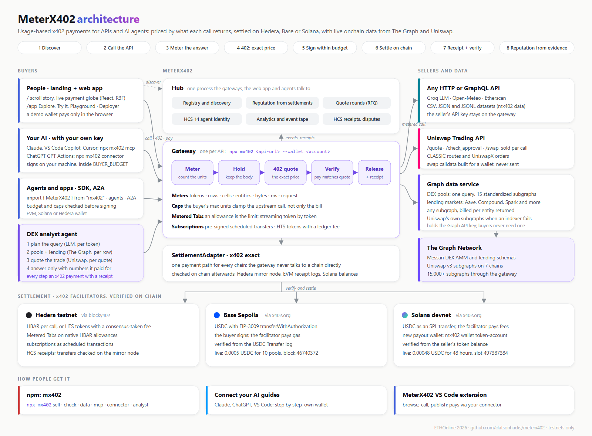

# MeterX402

**Pay per use, not per call.** Usage-based x402 payments for APIs and AI agents. Every call is
priced by what it actually returns (tokens, rows, pools, entities), paid inside a budget the buyer
sets, settled on **Hedera**, **Base** or **Solana**, and ends in a receipt anyone can check on
chain. Live onchain data comes from **The Graph** and executable swap quotes from **Uniswap**, sold
the same way.



[Submission](SUBMISSION.md) · [Architecture](ARCHITECTURE.md) · [Agent skill](skills/meterx402-onchain-data/SKILL.md) · [Uniswap feedback](FEEDBACK.md) · [Status](STATUS.md) · npm: [`mx402`](https://www.npmjs.com/package/mx402)

---

## Why

x402 lets any HTTP API charge per request, but a flat price per request is the wrong unit for most
APIs. A 5-token answer and a 4,000-token answer cost the same, so sellers price for the worst case
and light users pay for heavy ones. Agents make it worse: they call small things often and cannot
negotiate.

MeterX402 meters each response, quotes its exact price in the `402`, and lets the buyer pay only
that. MeterX402 began as a rebuild of [GlassBox402](https://github.com/dhernz/Glassbox402), which
wraps an API in x402 with one command, with its flat price replaced by metering.

| For | What you get |
|---|---|
| **API sellers** | `npx mx402 <url>` reads your API's response and picks the meter. Get paid in HBAR, HTS tokens, or USDC on Base and Solana. `mx402 data file.csv` sells a dataset per cell. |
| **People** | A web app with a live marketplace, task-shaped **Try it** forms, a spending limit, and receipts with explorer links. |
| **AI agents** | An SDK, an MCP server (12 tools), a REST connector with an OpenAPI spec, A2A agent cards and an agent skill. Budgets are checked before signing; every response is re-hashed and re-metered after paying. |
| **Your AI** | **Connect Claude, ChatGPT or VS Code** in a few steps. Each one pays from the user's own testnet account, on their machine, inside their budget: `npx mx402 mcp` or `npx mx402 connector`. |
| **Onchain data** | The Graph's standardized DEX and lending subgraphs, queried as one, plus **any subgraph billed per entity**, with no Graph key needed by the buyer. |
| **Swaps** | Uniswap Trading API quotes sold per call, and swap calldata built for a wallet: approval, Permit2 signature and transaction, never broadcast. |
| **Hedera-native** | Metered Tabs on allowances, subscriptions as scheduled transactions, HTS tokens with a ledger-taken fee, HCS receipts, HCS-14 agent identity, quote rounds. |

## Live on testnets

Every row below is a real settlement, checked independently afterwards.

**Hedera testnet**, through the blocky402 facilitator, each transfer checked on the mirror node:

| API | call | metered | paid | a flat price would charge |
|---|---|---|---|---|
| Groq `openai/gpt-oss-20b` | "say hello in 5 words" | 289 tokens | **0.00289 HBAR** | 0.04 |
| Groq `openai/gpt-oss-20b` | ~200-word explainer | 563 tokens | **0.00563 HBAR** | 0.04 |
| Open-Meteo | 1-day forecast | 24 rows | **0.0024 HBAR** | 0.024 |
| Etherscan v2 | 5 transactions | 5 rows | **0.005 HBAR** | 1.0 |

Each payment also writes a public HCS receipt to
[topic 0.0.10470327](https://hashscan.io/testnet/topic/0.0.10470327).

**Base Sepolia and Solana devnet**, USDC through the x402.org facilitator
(`npx tsx scripts/live-chains.ts`):

| chain | call | paid | checked on the chain |
|---|---|---|---|
| Solana devnet | `weather-solana`, 48 forecast hours | 0.00048 USDC | [34yVZcY9…](https://solscan.io/tx/34yVZcY96SnxgjfUh9T28yvDB96Aq5xJw5xv2BVm32LMD9zRuGd78io21FeVDyUVtEeXHB93ntyMsfxbdi7t3omH?cluster=devnet): 480 atomic USDC credited to the seller, slot 497387384 |
| Base Sepolia | `dex-pools-base`, 10 pools | 0.0005 USDC | [0x4a2081cb…](https://sepolia.basescan.org/tx/0x4a2081cb8c497c635aff5211d970a66c2899361733e39693c5e61d2b4593b649): 500 atomic USDC credited to the seller, block 46740372 |

**From npm, with brand-new wallets.** The published package (`npm i mx402`, identical to the
tarball tested) run from an empty folder: two new Hedera accounts from `mx402 wallet new`, a new
Base Sepolia payout address, and every command.

| step | what happened |
|---|---|
| `mx402 publish` open-meteo, `mx402 data cities.csv` | seller 0.0.10521862 live and listed; dataset priced per cell |
| SDK: quote then pay, one-step call, dataset | 48 rows 0.0096 HBAR, 24 rows 0.0048, 6 cells 0.0006; each re-hashed and re-metered; a call above its limit refused |
| `npx mx402 mcp` from a real MCP client | 12 tools; `get_quote` + `pay_for_service`, `call_service`, `find_lending_markets` paid |
| `mx402 connector` | paid on Hedera, on Base Sepolia to the new address, and on Solana devnet |
| `MeterX402Agent.call("weather_forecast")`, `mx402 analyst` | picked by reputation and paid; analyst 4 receipts, 0.012 HBAR |
| on chain, afterwards | mirror node: 13 payments into the new seller (+0.0552 HBAR); the new Base address holds 0.00048 USDC |

**The Graph and Uniswap**, paid from a Hedera buyer (`npx tsx scripts/live-graph.ts`,
`mx402 analyst "…"`):

| call | returned | paid |
|---|---|---|
| `lending-markets`, USDC by supply APY | 5 markets from 15/15 lending subgraphs (Spark 3.54%, Aave v3 3.52%, Compound v3 3.51% on Ethereum) | 0.0025 HBAR |
| `subgraph-gateway`, any GraphQL on Uniswap v3 | 9 entities (3 pools, 6 tokens) | 0.0009 HBAR |
| `subgraph-gateway`, a query that errors | `Type Query has no field notAField` | **nothing** |
| `dex-pools` on Base, Optimism, Avalanche, Arbitrum | 6 pools; Base answered through Uniswap's own subgraph after the standardized one timed out | 0.003 HBAR |
| DEX analyst: plan, pools, quote, answer | a grounded answer with 4 receipts | 0.017 HBAR |
| swap builder on Base | approval needed, Permit2 signed, 954-byte swap calldata, gas limit 97,000, **not sent** | 3 Trading API calls |

## Quick start

Without cloning anything:

```bash
npx mx402 check https://api.open-meteo.com/v1/forecast --sample '/?latitude=13&longitude=80&hourly=temperature_2m'
npx mx402 https://api.open-meteo.com/v1/forecast --wallet 0.0.your-account   # sell it, metered
npx mx402 mcp                                                                 # give an AI the tools (see Buying)
```

The whole stack, with the hub, web app and every lane:

```bash
npm install
npm run demo:offline        # zero config: mock upstream + a mock facilitator that really checks signatures
```

Open <http://localhost:4021>. For real settlement:

```bash
cp .env.example .env                  # WALLET, BUYER_ACCOUNT_ID/BUYER_PRIVATE_KEY, and API keys
npx tsx scripts/new-buyer.ts          # optional: a funded Hedera testnet buyer
npx tsx scripts/new-chain-wallets.ts  # optional: Base Sepolia + Solana devnet wallets (fund at faucet.circle.com)
npm run demo                          # hub + every lane in lanes.json, + The Graph service when GRAPH_API_KEY is set
```

| Key | Unlocks |
|---|---|
| `BUYER_ACCOUNT_ID`, `BUYER_PRIVATE_KEY`, `WALLET` | Hedera payments (required) |
| `GROQ_API_KEY` | the `llm` lane, and the analyst's planning and answers |
| `GRAPH_API_KEY` | `dex-pools`, `lending-markets`, `subgraph-gateway`, `uniswap-data` |
| `UNISWAP_API_KEY` | `uniswap-quote` and the swap builder |
| `BUYER_EVM_PRIVATE_KEY`, `WALLET_EVM` | USDC on Base Sepolia (`dex-pools-base`) |
| `BUYER_SOLANA_SECRET_KEY`, `WALLET_SOLANA` | USDC on Solana devnet (`weather-solana`) |

A lane whose key is missing is skipped rather than started broken. Everything is testnet only.

## How a payment works

### Meter, then pay: exact, per call, no custody

The price of a response cannot be known before the response exists. So the gateway runs the call,
counts the units, **holds** the body, and answers `402` with the exact price of that response:

```
buyer ── request (x-meter-max-units: 800) ─▶ mx402 ── clamped to the cap ─▶ the API
      ◀─ 402: 612 tokens × 0.01/1000 = 0.00612 HBAR ──┤ (body held, its sha256 committed)
      ── same request + PAYMENT-SIGNATURE ───────────▶│ verify + settle through the facilitator
      ◀─ 200 + the held body + receipt ───────────────┘ (one transaction, exact amount)
```

The buyer sees the units and the price before signing, and the x402 client refuses to sign above
the buyer's cap. There are no deposits and no refunds, and the resource server holds no key. After
paying, the SDK re-hashes the body and re-meters it; a mismatch files a dispute that costs the
seller reputation.

### Metered Tabs: the limit lives on chain, and streaming works (Hedera)

A buyer approves a native HBAR allowance to the lane once. That allowance is the spending limit,
enforced by the ledger. Calls then run with no per-call payment (9 to 15 ms instead of a consensus
round trip), are debited as they go, and settle in one approved transfer per batch. Streaming
responses (SSE, token by token) are sold only on tabs, because pay-per-call must hold the body
until it is paid. When a stream crosses the buyer's cap, the gateway cancels the upstream and bills
exactly the cap.

### Subscriptions, tokens and identity (Hedera)

- **Subscriptions.** The buyer pre-signs every future payment as a scheduled transaction
  (`wait_for_expiry`), one per period. Consensus executes them unattended, and the buyer keeps the
  admin key to cancel any period that has not run.
- **HTS tokens with a ledger fee.** `--asset <token>` settles in a token whose custom fee schedule
  routes the protocol's cut on every transfer. There is no fee code in this repo. Live: a 0.24 MXC
  call credited the seller 0.2352 and the treasury 0.0048.
- **HCS-14 identity.** Every service carries a Universal Agent ID: a SHA-384 hash of its canonical
  fields, re-derived by the registry to verify the claim. It matches
  `@hashgraphonline/standards-sdk` byte for byte.
- **Quote rounds.** `agent.rfq({ capability, maxUnits, maxPrice })` asks every live seller at once
  and scores them: price 0.45, reputation 0.4, latency 0.15.

### Base and Solana

The same gateway, SDK and receipts; a lane picks its chain with `--chain base-sepolia` or
`--chain solana-devnet`.

- **Presets.** [src/chains.ts#L48](src/chains.ts#L48) (Base Sepolia) and
  [#L72](src/chains.ts#L72) (Solana devnet), with USDC per network at
  [#L100](src/chains.ts#L100).
- **Signing.** The buyer signs with viem (EIP-3009) or `@solana/kit` (SPL transfer), loaded only
  when used: [src/sdk/buyer.ts#L334](src/sdk/buyer.ts#L334).
- **Checked on the chain, not taken from the facilitator.**
  - EVM: USDC `Transfer` logs, [src/settlement/verify-chains.ts#L52](src/settlement/verify-chains.ts#L52).
  - Solana: the seller's token balance change, [#L71](src/settlement/verify-chains.ts#L71).

```ts
new MeterX402({ wallet: { privateKey: process.env.BUYER_EVM_PRIVATE_KEY, network: "eip155:84532" }, budget: "0.05 USDC", registry });
new MeterX402({ wallet: { privateKey: process.env.BUYER_SOLANA_SECRET_KEY, network: "solana:EtWTRABZaYq6iMfeYKouRu166VU2xqa1" }, registry });
```

## The Graph

A Graph data service ([src/graph/server.ts](src/graph/server.ts)) holds the Graph API key and sits
behind three metered lanes. Buyers pay per result and never need a key of their own.

### Standardized DEX pools, one query across 15 subgraphs

`dex-pools` ([lanes.json#L172](lanes.json#L172), and in USDC on Base at
[#L190](lanes.json#L190)) asks every Messari DEX AMM subgraph the same question at once. That
covers Uniswap v3 on seven chains, SushiSwap, PancakeSwap, Curve, Balancer, Camelot and Velodrome.
The answers merge into one table of TVL, 24h volume, fee and fee APR, priced per pool.

| | code |
|---|---|
| the sources, one line per subgraph | [src/graph/standard.ts#L36](src/graph/standard.ts#L36) |
| the one query, standard-schema fields only | [#L57](src/graph/standard.ts#L57) |
| one shape for every protocol | [#L208](src/graph/standard.ts#L208) |
| parallel fan-out with per-source reports and a circuit breaker | [#L261](src/graph/standard.ts#L261), [#L309](src/graph/standard.ts#L309), [#L331](src/graph/standard.ts#L331) |
| Uniswap's own v3 subgraphs as fallbacks, mapped into the same shape | [#L72](src/graph/standard.ts#L72), [#L227](src/graph/standard.ts#L227) |

What the standard bought:
- **No per-protocol adapters.** Uniswap, Curve and Balancer describe fees and liquidity
  differently, and one `normalize` covers all of them.
- **Adding a chain is one line.**
- **Comparable yields.** Fee APR is computed the same way for every protocol.

Where the standard ran out, the fallback shows what it costs to do without one: Uniswap's own
schema needs its own query, its own fee units (`feeTier` in hundredths of a basis point), its own
price conversion (`derivedETH` × the bundle price) and client-side token filtering. Every response
reports each source's `schema`, `via: "fallback"` and errors, so coverage gaps are visible.

### Lending markets, a second standard

`lending-markets` ([lanes.json#L250](lanes.json#L250)) runs one Messari lending query over 15
subgraphs: Aave v3 on seven chains, Compound v2 and v3, Spark, Venus, Benqi and Radiant. It
returns supply APY, variable borrow APY, deposits, utilization and max LTV.
Code: [src/graph/lending.ts#L16](src/graph/lending.ts#L16) (sources),
[#L35](src/graph/lending.ts#L35) (query), [#L94](src/graph/lending.ts#L94) (normalize),
[#L155](src/graph/lending.ts#L155) (fan-out).

Because the DEX and lending schemas share their token and USD conventions, the analyst can set a
pool's fee APR beside a lending rate without converting anything.

### Any subgraph, billed per entity

`subgraph-gateway` ([lanes.json#L268](lanes.json#L268)): POST any GraphQL to `/subgraphs/<id>` or
`/deployments/<Qm…>`. The meter is `json:entities`: every object in the answer counts once, and a
query that errors or finds nothing costs nothing.
Code: [src/graph/subgraphs.ts#L15](src/graph/subgraphs.ts#L15) (entity count),
[#L29](src/graph/subgraphs.ts#L29) (read-only, size-capped queries),
[#L41](src/graph/subgraphs.ts#L41) (proxy).

### AI tooling

- **MCP tools**, in the `mx402 mcp` server:
  - `find_dex_pools` ([src/mcp.ts#L89](src/mcp.ts#L89))
  - `ask_dex_analyst` ([#L116](src/mcp.ts#L116))
  - `find_lending_markets` ([#L137](src/mcp.ts#L137))
  - `query_subgraph` ([#L164](src/mcp.ts#L164))
- **An agent skill** teaching when to buy which data, how to spend carefully and how to read
  coverage: [skills/meterx402-onchain-data/SKILL.md](skills/meterx402-onchain-data/SKILL.md).
- **The DEX analyst**, an agent that uses The Graph as its live source (below).

## The DEX analyst

```bash
mx402 analyst "Where should USDC earn the most right now: lending it, or providing liquidity against ETH?"
```

An agent that pays for its own research, one x402 payment per step, inside the buyer's budget:

1. **Plan** the query with an LLM, paid per token.
2. **Read** pools (and, for yield or lending questions, lending markets) from The Graph, paid per row.
3. **Quote** the trade with the Uniswap Trading API, paid per quote.
4. **Answer** with the LLM, paid per token.

The numbers the answer rests on are computed in code
([src/graph/analyst.ts#L210](src/graph/analyst.ts#L210)):
- the best pool above a TVL floor
- fee APR against the lending rate, with the difference
- the implied price
- thin-liquidity and utilization warnings

The LLM only chooses what to look up and writes prose around those facts. A rules planner stands
in when no LLM is available ([#L121](src/graph/analyst.ts#L121)). A grounding filter then cuts any
sentence that states a number the paid data does not contain
([#L288](src/graph/analyst.ts#L288)). In one live run the model added "≈ $5,048.50 per USDC"; the
filter removed it and reported that it had.

```
Paid:
  plan    llm            400 tokens → 0.004 HBAR  tx 0.0.7162784@1789247964.071079545
  pools   dex-pools      12 rows    → 0.006 HBAR  tx 0.0.7162784@1789247975.321851525
  quote   uniswap-quote  1 request  → 0.002 HBAR  tx 0.0.7162784@1789247977.589209659
  answer  llm            500 tokens → 0.005 HBAR  tx 0.0.7162784@1789247982.127388281
  total: 0.017 HBAR
```

The analyst is also available as the Playground's lead panel (`POST /playground/analyst`,
[src/hub.ts#L483](src/hub.ts#L483)), as the MCP tool `ask_dex_analyst`, and as the link
`/?ask=…#user/playground`.

## Uniswap

- **`uniswap-quote` lane** ([lanes.json#L210](lanes.json#L210)). It sells the Trading API per call:
  `/quote`, `/check_approval` and `/swap`. The API key stays in the gateway.
- **The analyst's trade step.**
  - [src/graph/analyst.ts#L307](src/graph/analyst.ts#L307) builds the `/quote` body from the
    deepest pool on a chain the API serves, using token addresses and decimals from The Graph.
  - [#L454](src/graph/analyst.ts#L454) pays for it.
  - [#L337](src/graph/analyst.ts#L337) reads CLASSIC routes and UniswapX orders, which are gasless
    for the swapper, without inventing the fields UniswapX does not return.
- **The swap builder** ([src/graph/swap.ts#L76](src/graph/swap.ts#L76), exposed at
  `POST /playground/swap`, [src/hub.ts#L498](src/hub.ts#L498)). It runs a paid approval check, a
  quote for the real wallet, a Permit2 signature ([#L65](src/graph/swap.ts#L65) finds the EIP-712
  primary type) and `/swap` ([#L146](src/graph/swap.ts#L146)), then returns unsigned transactions.
  It never broadcasts, and it leaves UniswapX orders as quotes.
- **Uniswap v3 subgraphs.** The `uniswap-data` lane ([lanes.json#L114](lanes.json#L114)), and the
  fallbacks inside `dex-pools`.
- **Developer feedback:** [FEEDBACK.md](FEEDBACK.md).

## Selling a service

```bash
npx mx402 check https://api.open-meteo.com/v1/forecast --sample '/?latitude=13&longitude=80&hourly=temperature_2m&forecast_days=2'
npx mx402 https://api.open-meteo.com/v1/forecast --wallet 0.0.1234     # or --chain base-sepolia --wallet 0x…
npx mx402 publish <url> --wallet <acct>                               # also list it in a registry
npx mx402 data weather-2026.csv --wallet 0.0.1234                     # a dataset, priced per cell
npx mx402 wallet token-account --chain solana-devnet --owner <addr>   # a new Solana payout wallet's USDC account
```

A Solana wallet that has never held USDC cannot be paid until it has a USDC token account. The
gateway checks at start and prints this command when it is missing.

| Your API returns | Metered as |
|---|---|
| `usage.total_tokens` / `eval_count` / `usageMetadata` | `tokens` |
| any list, however nested (`data.pools`, `result`, `hourly.time`) | `rows:<path>` |
| a number it reports itself (`entities`, `usage.credits`) | `json:<path>` |
| a large body with neither | `bytes` |
| a small fixed object | `request` (flat) |

| Seller flag | |
|---|---|
| `--meter`, `--rate`, `--per`, `--min`, `--free`, `--max-units` | pricing; detected values are only a starting point |
| `--chain`, `--asset` | where and in what it settles |
| `--tab`, `--subscribe --period --sub-units` | Metered Tabs and subscriptions (Hedera) |
| `--header "K: V"`, `--query k=v` | upstream auth; your key never reaches the buyer |

| Buyer control | Enforced by |
|---|---|
| `x-meter-max-units` (or `max_tokens`) | the gateway: the upstream request is clamped, billing stops at the cap |
| `maxPerCall`, `budget` | the buyer's own x402 client, before it signs |
| the allowance | the ledger, for tabs |

## Buying

| Interface | How |
|---|---|
| SDK | `new MeterX402({ wallet, budget, registry })`: `discover`, `quote`, `pay`, `call`. `MeterX402Agent` adds capability calls, tabs, quote rounds and A2A. |
| MCP | `npx mx402 mcp`: 12 tools, from `list_services` and `call_service` to `query_subgraph` and `ask_dex_analyst` |
| REST connector | `npx mx402 connector`: an OpenAPI API (`listServices`, `getQuote`, `payQuote`, `callService`, `getWallet`) behind a bearer token, for ChatGPT Custom GPT Actions, the VS Code extension and function-calling LLMs |
| A2A | `POST /a2a` `message/send` → `input-required` with an x402 quote → pay in task metadata → `completed` with a receipt |
| HTTP | plain x402: call the endpoint, pay the `402` |

### Connecting an AI: always your own wallet

The web app's demo wallet only pays for what someone tries in the browser. Every connected tool
signs on the user's own machine with the user's own testnet key (`BUYER_ACCOUNT_ID` /
`BUYER_PRIVATE_KEY`, plus `BUYER_EVM_PRIVATE_KEY` or `BUYER_SOLANA_SECRET_KEY` for Base or Solana
services), inside `BUYER_BUDGET` and `BUYER_MAX_PER_CALL`, and discovers services from `MX_HUB`.

| Tool | How it connects |
|---|---|
| Claude Desktop, Claude Code | MCP: `npx -y mx402 mcp` in `claude_desktop_config.json`, or `claude mcp add meterx402 -e … -- npx -y mx402 mcp` |
| ChatGPT | `npx mx402 connector` on your machine, a tunnel (`ngrok http 3402`), then import `<tunnel>/openapi.json` as a GPT Action with Bearer auth |
| VS Code (Copilot agent mode), Cursor | MCP: `.vscode/mcp.json` (the key is asked once and kept in VS Code's secret storage) or `.cursor/mcp.json` |
| MeterX402 VS Code extension | browse, call and publish from the sidebar; **Start My Connector** runs `mx402 connector` with your key, and the extension only holds its token |

The app's Explore page has step-by-step guides for each (**Use it from your AI**), and
`/app?connect=claude|chatgpt|vscode` opens one directly.

## Registry and reputation

`GET /registry/services?capability=lending_rates&minReputation=90&maxPrice=0.05` returns services
ranked by reputation, price and latency. Reputation is a deterministic score from payment evidence:

| Component | Weight |
|---|---|
| execution | 30% |
| response success | 20% |
| latency | 15% |
| disputes | 15% |
| uptime | 10% |
| payment reliability | 10% |

A buyer's own mistakes never count against a seller, and a service stays unrated until it has 5
samples. `POST /registry/reputation/anchor` writes every score's digest to HCS.

## The web app

`npm run demo` serves two pages from <http://localhost:4021>.

**`/` is the landing page.** It is a scroll-driven story built with Vite, React, React Three Fiber,
GSAP ScrollTrigger and Lenis.

- A live payment globe draws an arc for each recent real receipt, landing at the chain that
  settled it.
- As you scroll, the globe hands off to an x402 coin that flips to "paid" at the payment step, then
  turns to Hedera, Base and Solana in turn.
- A ring of subgraphs orbits it for The Graph.

The whole page follows the light/dark theme toggle, 3D included. Three.js loads as a separate chunk
after first paint, and the scene pauses while the tab is hidden. It never loads in the app. The
source is in `landing/`, and the build is committed to `public/landing`. Run
`npm run build:landing` to rebuild it, or `npm run dev:landing` for hot reload on :5173 (it proxies
the hub).

**`/app` is the app.** It has no build step: vanilla JS and CSS in `public/`. The top switch has
two modes.

- **User** is blue.
  - **Explore**: a hero that replays a real recent settlement, live stats, a receipts ticker, and
    the marketplace with task-shaped Try it forms for chat, weather, transactions, prices,
    datasets, DEX pools, lending rates and any subgraph.
  - **Activity**: what this wallet paid, and the proof for each payment.
  - **Playground**: the DEX analyst, plus live code for SDK, MCP, A2A, HTTP and CLI with a Run
    button.
- **Deployer** is violet.
  - **Overview**: earnings and the per-call price spread.
  - **APIs**: sell an API or a dataset, and test buyers.
  - **Payments** and **Registry**.

Deep links: `/app#user/playground`, `/app?open=lending-markets&tab=try`, `/app?ask=<question>`,
`/app#deployer/apis`, `?theme=dark`. Older links without `/app` are forwarded.

## Repository map

```
src/gateway.ts         the gateway: meter → hold → 402 → verify → settle → release; tabs; streaming
src/meters.ts          what a response consumed: tokens, rows, cells, json, bytes, ms
src/pricing.ts         units → exact atomic amount (integer, always rounded up)
src/settlement/        SettlementAdapter, x402 exact, route selection, EVM + Solana verification
src/chains.ts          Hedera, Base, Base Sepolia, Solana, Solana devnet presets; HTS tokens
src/graph/             The Graph: standard.ts (DEX), lending.ts, subgraphs.ts (any subgraph),
                       server.ts (the data service), analyst.ts (the DEX analyst), swap.ts (Uniswap)
src/registry/          registry, reputation engine, HCS-14 resolution, quote rounds
src/sdk/               MeterX402 (buyer), MeterX402Agent, wrap (seller)
src/mcp.ts             the MCP server
src/adapters/a2a.ts    every service as an A2A agent
src/hub.ts             registry API, events, analytics, HCS receipts, the web app's backend
src/cli.ts             check, publish, data, inspect, wallet, analyst, mcp
src/tabs.ts, subscriptions.ts, holds.ts, data.ts, detect.ts, hedera.ts
public/                the web app at /app (no build step); public/landing is the built landing page
landing/               the landing page source: Vite + React + React Three Fiber + GSAP
skills/                the agent skill for onchain data
scripts/               live proofs: live-chains, live-graph, live-agent, live-hts, live-subscription, live-rfq
packages/mx402/        the npm package: bundled CLI + SDK
lanes.json             every API being sold
docs/                  architecture diagram
```

## Testing

```bash
npm test                          # 221 tests: 166 unit + 55 end-to-end
npm run test:live                 # real Hedera testnet, mirror-node verified
npx tsx scripts/live-chains.ts    # USDC payments on Base Sepolia and Solana devnet
npx tsx scripts/live-graph.ts     # lending, any subgraph, a free failed query, DEX fallbacks
npx tsx scripts/live-agent.ts     # the whole lifecycle as an agent
```

The end-to-end suite is not mocked at the protocol level. It signs real Hedera transfer
transactions with the official `@x402` client and settles them against a mock facilitator that
decodes each one and checks payer, payTo, amount, fee payer, signature and replay. It covers
tampering, replay, expiry, insufficient funds, caps, budgets, tab batching, revocation and
streaming. The connector tests check that everything except its spec needs the bearer token. The unit tests cover the Graph fan-out, fallbacks, lending, entity metering, the
analyst's planner, facts and grounding filter, and the swap builder, including recovering the
Permit2 signer.

## Security and limits

- **Testnets only.** No mainnet keys belong in `.env`, and the swap builder never broadcasts.
- **The resource server holds no buyer key.** Buyers sign; facilitators settle; settlements are
  re-checked on chain.
- **`/deploy` and `/playground` are loopback-only.** They are the web app's backend, and the only
  place the demo wallet pays; anyone can read the registry.
- **Connected AIs never use the demo wallet.** `mx402 mcp` and `mx402 connector` sign with the
  user's own key where they run. The connector refuses every call except `/health` and
  `/openapi.json` without its bearer token, because a tunnel makes it public.
- **Standardized subgraph coverage varies.** In our runs Base, Optimism and BSC Uniswap v3
  deployments timed out or had failing indexers. Fallbacks and the per-source report make that
  visible rather than silent.
- **More.** See [STATUS.md](STATUS.md) for pending work and known issues.

## Credits

Built at ETHOnline 2026 by [clatsonhacks](https://github.com/clatsonhacks) and
[Anto-099-New-State](https://github.com/Anto-099-New-State). It stands on:
- x402 and its Hedera, EVM and SVM schemes
- the blocky402 and x402.org facilitators
- The Graph and Messari's standardized subgraphs
- the Uniswap Trading API
- GlassBox402, for the one-command wrapper idea

## License

MIT
